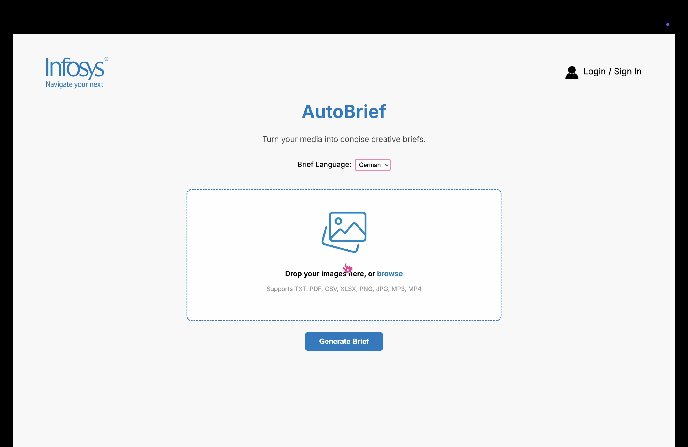

# AutoBrief: Auto-Generating Insight-Driven Creative Briefs from Business Inputs

## 🎥 Demo

[](https://youtu.be/yqm-2ItKmmU)

<details>
<summary>Prefer inline playback?</summary>

<video src="assets/demo.mov" controls width="720">
  Your browser doesn’t support video. Watch on
  <a href="https://youtu.be/yqm-2ItKmmU">YouTube</a>.
</video>

</details>


## Overview

AutoBrief is a multi-agent AI system that transforms **unstructured business inputs** (documents, images, videos, URLs) into professional, actionable **creative briefs**.  

The system also provides **automated meeting scheduling** and **task management** to streamline execution.

Developed for **EdgeVerve AI Next's Hackathon Challenge**, AutoBrief cuts down the creative brief process from **hours to seconds**.


## Multi-Agent Architecture

- **Parser Agent**  
  Extracts and normalizes content from diverse file formats (PDFs, images, videos, Excel sheets, and URLs).

- **Briefer Agent**  
  Synthesizes parsed content into structured creative briefs with objectives, audience insights, and messaging recommendations.

- **Scheduler Agent**  
  Creates optimized meeting schedules and task lists with team member assignments.


## Key Features

- **Multi-Modal Input Processing** – Upload docs, images, videos, spreadsheets, or web URLs  
- **Intelligent Content Analysis** – AI-powered extraction and synthesis of key business insights  
- **Automated Brief Generation** – Professional PDF creative briefs with consistent formatting  
- **Smart Meeting Scheduling** – Context-aware meeting suggestions with stakeholders  
- **Actionable Task Management** – Priority-based task assignments with dependencies  
- **Multi-language Support** – Enable global teams to collaborate seamlessly by processing and generating content in their native languages


## Tech Stack

- **Backend**: Python, FastAPI, OpenAI GPT-3.5-Turbo  
- **Frontend**: React, Modern UI/UX  
- **Processing**: Whisper, Pandas, Openpyxl  
- **Output**: ReportLab PDF generation  


## Built For

Marketing teams, creative agencies, and business leaders who need to quickly transform scattered inputs into **coherent creative strategies and execution plans**.


## Setup & Run

### Backend (FastAPI + Python)

```bash
cd BizHacks/backend

# Create virtual environment
python -m venv venv
source venv/bin/activate   # Mac/Linux
venv\Scripts\activate      # Windows

# Install dependencies
pip install -r ../requirements.txt

# Run the backend
python main.py
```

The backend will start on http://localhost:8000 (default).

### Frontend (React)

```bash
cd BizHacks/frontend

# Install dependencies
npm install

# Start development server
npm start
```

The frontend will run on http://localhost:3000.


## Project Structure

```
BizHacks/
├── backend/           # FastAPI backend
│   ├── main.py
│   ├── agents/        # Parser, Briefer, Scheduler agents
│   └── utils/         # File loaders, PDF generators
│
├── frontend/          # React frontend
│   ├── src/
│   ├── public/
│   └── package.json
│
├── test/              # Unit tests
├── requirements.txt   # Python dependencies
└── README.md
```


## Future Improvements

- Brand Consistency, maintaining company voice and formatting standards  
- Integration with Slack/MS Teams for collaboration


## Contribution

Pull requests are welcome! For major changes, please open an issue first to discuss what you'd like to modify.
